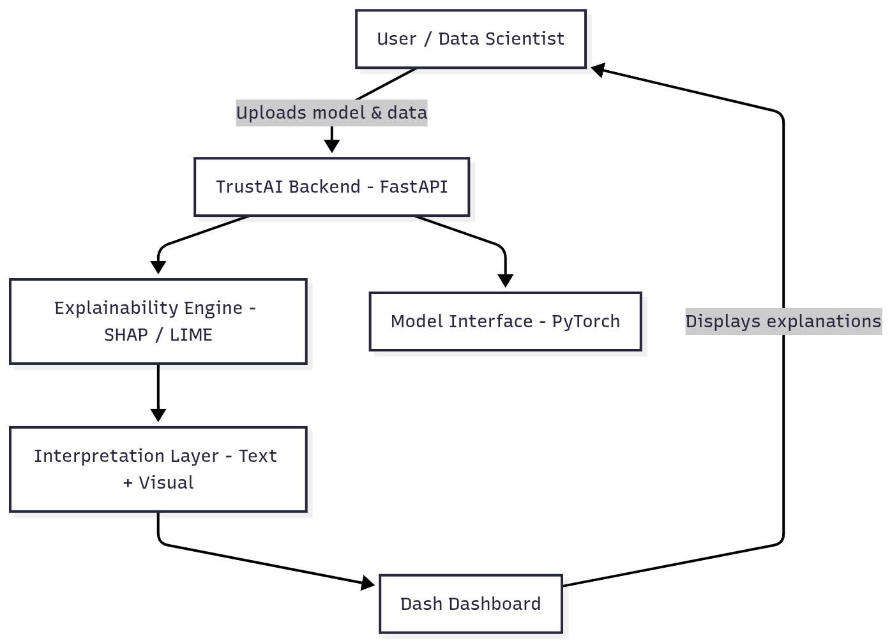
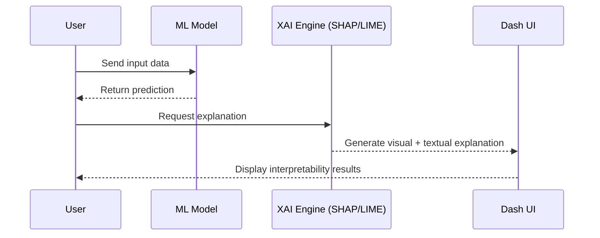

# Aixplain Explainable Machine Learning Framework

## 📘 Overview
**TrustAI** is a framework designed to make machine learning models transparent, interpretable, and trustworthy.  
It allows users to visualize and understand how AI systems make predictions through feature explanations, visual dashboards, and plain-language summaries.

TrustAI bridges the gap between black-box AI and human understanding — enabling better debugging, model validation, and ethical decision-making.

---

## 🎯 Objectives
- Enhance interpretability of complex ML/DL models.  
- Provide local and global explanations using SHAP and LIME.  
- Offer an interactive dashboard for visualization and analysis.  
- Generate text-based, human-readable explanations.  
- Enable API access for real-time explainability in deployed systems.  

---

## ⚙️ Tech Stack
| Layer | Tools & Frameworks |
|-------|--------------------|
| **Language** | Python |
| **Explainability** | SHAP, LIME |
| **Frontend Interface** | Dash |
| **Backend / API** | FastAPI |
| **Deep Learning Support** | PyTorch |
| **Visualization** | Plotly |

---

## 🧩 Core Modules

| Module | Description |
|---------|-------------|
| **1. Feature Importance Analyzer** | Computes each feature’s contribution to model predictions using SHAP or LIME. |
| **2. Local Explanation Viewer** | Displays instance-specific reasoning (why the model made this prediction). |
| **3. Global Model Insights** | Provides an overview of overall trends, relationships, and potential biases. |
| **4. Visual Explainer Dashboard** | Dash-based interactive interface for visualizing explanations. |
| **5. Text Explanation Generator** | Converts model reasoning into natural-language summaries. |
| **6. Bias & Fairness Detector** | Detects and visualizes possible bias in data or predictions. |

---

## 🏗️ System Architecture

<p align="center">
  
</p>

## 🔄 Concept Flow


## 🧠 Workflow Summary

# Input:
Trained ML/DL model + test dataset

# Processing:

Run SHAP/LIME to compute feature importance

Detect bias and compute trust metrics

Generate human-readable text explanations

# Output:

Visual explanations (bar charts, heatmaps)

Text summaries of reasoning

Bias / trust reports


## 💻 Implementation Steps

# Model Integration:
Import trained PyTorch or scikit-learn model.

# Backend Setup:
FastAPI endpoints handle model uploads and explanation requests.

# Explanation Computation:
SHAP/LIME runs locally to generate explanation data.

# Frontend Dashboard:
Dash visualizes explanations with Plotly graphs and natural-language summaries.

#API Access:
External systems can request explanations via REST API


## 🚀 Setup & Usage
```bash
# Clone repository
git clone https://github.com/yourusername/trustai.git
cd trustai

# Create virtual environment
python -m venv venv
source venv/bin/activate  # or venv\Scripts\activate on Windows

# Install dependencies
pip install -r requirements.txt

# Run FastAPI backend
uvicorn backend.main:app --reload

# Run Dash dashboard
python dashboard/app.py
```

## 🔮 Future Enhancements

Integrate counterfactual explanations (“If X changed, prediction would be Y”).

Add uncertainty and trust calibration metrics.

Expand support for transformer-based NLP models.

Deploy as a containerized microservice (Docker).

Add multilingual explanation generation using LLMs


## 📚 References

Lundberg, S.M. & Lee, S.-I. “A Unified Approach to Interpreting Model Predictions (SHAP)”, NIPS 2017.

Ribeiro, M.T. et al. “Why Should I Trust You? Explaining the Predictions of Any Classifier (LIME)”, KDD 2016.

Molnar, C. Interpretable Machine Learning (Book).

IBM AI Fairness 360 & Microsoft Fairlearn Toolkits.
